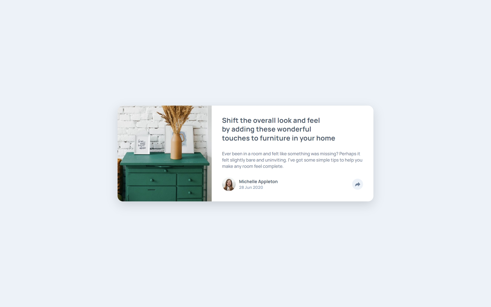
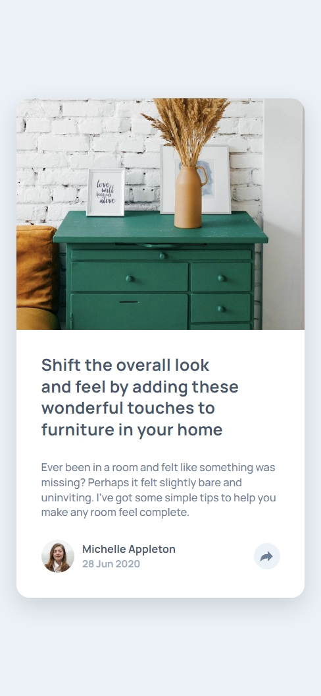

# Frontend Mentor - Article preview component solution

This is a solution to the [Article preview component challenge on Frontend Mentor](https://www.frontendmentor.io/challenges/article-preview-component-dYBN_pYFT). Frontend Mentor challenges help you improve your coding skills by building realistic projects.

## Table of contents

- [Overview](#overview)
  - [The challenge](#the-challenge)
  - [Screenshot](#screenshot)
  - [Links](#links)
- [My process](#my-process)
  - [Built with](#built-with)
  - [What I learned](#what-i-learned)
- [Author](#author)

## Overview

### The challenge

Users should be able to:

- View the optimal layout for the component depending on their device's screen size
- See the social media share links when they click the share icon

### Screenshot

#### Desktop



#### Mobile



### Links

- Solution URL: [Github](https://github.com/TusharKaundal/article-preview-component-master)
- Live Site URL: [Netlify](https://teal-paletas-0a462f.netlify.app/)

## My process

### Built with

- Semantic HTML5 markup
- CSS custom properties
- Flexbox
- Mobile-first workflow
- [Javascript](https://developer.mozilla.org/en-US/docs/Web/JavaScript) - For script

### What I learned

- Learned how to use flex shrink flex grow and fle basis to give more of responsive layout.
- Got to learn how to add eventListener when the Content is getting loaded.-

```js
document.addEventListener("DOMContentLoaded", () => {
  const shareBtn = document.querySelector(".share-btn");
  const shareBtnMobile = document.querySelector(".share-btn-mobile");
  const sharePopup = document.querySelector(".share-popup");
  const articleFooter = document.querySelector(".article-footer");
  const articleFooterMobile = document.querySelector(".article-footer-mobile");

  shareBtn.addEventListener("click", () => {
    sharePopup.classList.toggle("show-popup");
    articleFooter.classList.toggle("hidden");
    articleFooterMobile.classList.toggle("hidden");
    shareBtn.classList.toggle("clicked");
    shareBtnMobile.classList.toggle("clicked");
  });
  shareBtnMobile.addEventListener("click", () => {
    sharePopup.classList.toggle("show-popup");
    articleFooter.classList.toggle("hidden");
    articleFooterMobile.classList.toggle("hidden");
    shareBtn.classList.toggle("clicked");
    shareBtnMobile.classList.toggle("clicked");
  });
});
```

## Author

- Frontend Mentor - [@TusharKaundal](https://www.frontendmentor.io/profile/TusharKaundal)